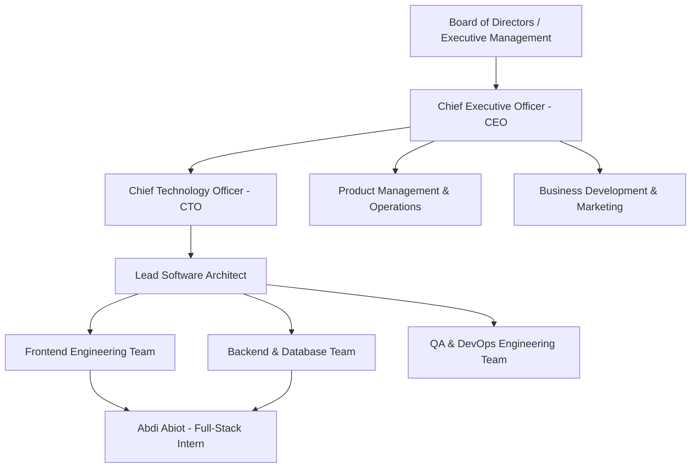
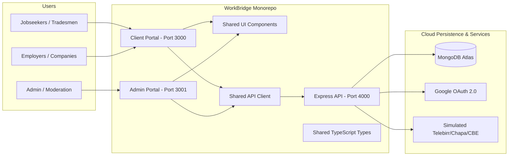

# DIRE DAWA UNIVERSITY
## INSTITUTE OF TECHNOLOGY (IOT)
### DEPARTMENT OF SOFTWARE ENGINEERING

---

# INTERNSHIP REPORT ON:
## **WorkBridge: A Multi-Tenant Freemium Digital Labor & Skill Marketplace Platform for Ethiopia**

---

**Prepared By:**  
- **Student Name:** Abdi Abiot  
- **Student ID:** DDU1500744  
- **Department:** Software Engineering  
- **Academic Year:** 2025/2026 (2018 E.C.)  

**Host Organization:**  
- **Company Name:** SORARDI PLC  
- **Internship Period:** March 1, 2026 – August 29, 2026 (6 Months)  
- **Submission Date:** September 2026  
- **Academic Advisor:** Department of Software Engineering Internship Coordinator  
- **Industry Supervisor:** Lead Software Architect, SORARDI PLC  

---

\newpage

## DEDICATION & ACKNOWLEDGMENT

First and foremost, I would like to express my deepest gratitude to Almighty God for providing me with the health, strength, and endurance to successfully complete this 6-month software engineering industrial internship and this comprehensive report.

I extend my sincere appreciation to **Dire Dawa University, Institute of Technology (IoT)**, and the **Department of Software Engineering** for designing an academic curriculum that bridges the gap between foundational theoretical knowledge and real-world industrial practice.

Special thanks go to my academic advisor and the faculty members of the Software Engineering Department for their continuous guidance, intellectual mentorship, and high academic standards throughout my undergraduate journey.

I would also like to express my gratitude to the management and engineering staff of **SORARDI PLC** for granting me the privilege to intern within their software development team. I am deeply indebted to my industry supervisor and senior engineering colleagues for their invaluable code reviews, technical guidance in modern full-stack monorepo architectures, and for providing a stimulating environment where I could contribute to the development of the **WorkBridge** enterprise platform.

Lastly, I express my heartfelt gratitude to my family and peers for their constant encouragement, prayers, and moral support throughout my academic studies.

---

\newpage

## LIST OF ACRONYMS & ABBREVIATIONS

| Acronym | Definition |
| :--- | :--- |
| **API** | Application Programming Interface |
| **CBE** | Commercial Bank of Ethiopia (CBE Birr) |
| **CI/CD** | Continuous Integration / Continuous Deployment |
| **CSS** | Cascading Style Sheets |
| **CORS** | Cross-Origin Resource Sharing |
| **DTO** | Data Transfer Object |
| **DOM** | Document Object Model |
| **ESLint** | ECMAScript Linting Utility |
| **ETB** | Ethiopian Birr (Currency) |
| **HTTP/HTTPS** | Hypertext Transfer Protocol (Secure) |
| **IoT** | Institute of Technology |
| **JSON** | JavaScript Object Notation |
| **JWT** | JSON Web Token |
| **MVC** | Model-View-Controller |
| **NoSQL** | Not Only SQL (Non-Relational Database) |
| **OAuth** | Open Authorization Framework |
| **ODM** | Object-Document Mapper (Mongoose) |
| **PLC** | Private Limited Company |
| **RBAC** | Role-Based Access Control |
| **REST** | Representational State Transfer |
| **SDK** | Software Development Kit |
| **SPA** | Single Page Application |
| **SSR** | Server-Side Rendering |
| **TS** | TypeScript |
| **UI/UX** | User Interface / User Experience |
| **URI/URL** | Uniform Resource Identifier / Locator |
| **VCS** | Version Control System (Git) |

---

\newpage

## TABLE OF CONTENTS

1. **Executive Summary**
2. **Chapter 1: Introduction**
   - 1.1 Purpose of the Internship
   - 1.2 Relationship to Software Engineering Curriculum
   - 1.3 Scope and Objectives
3. **Chapter 2: Host Company Profile (SORARDI PLC)**
   - 2.1 Overview & History
   - 2.2 Core Products and Technology Services
   - 2.3 Organizational Structure & Engineering Division
   - 2.4 Development Culture & Methodologies
4. **Chapter 3: Internship Activities & Project Work**
   - 3.1 Overview of the Primary Project: *WorkBridge*
   - 3.2 Problem Statement & Motivation
   - 3.3 Roles and Core Responsibilities
   - 3.4 Software Architecture & Monorepo Design
   - 3.5 Specific Features & Modules Implemented (Phases 1–9)
   - 3.6 Two-Sided Freemium Business Model & Simulated Payments
5. **Chapter 4: Technical Skills & Tools Utilized**
   - 4.1 Frontend Engineering Stack
   - 4.2 Backend & Database Architecture
   - 4.3 Security, Authentication, & Identity
   - 4.4 DevOps, Code Quality, & Monorepo Tooling
   - 4.5 Soft Skills & Professional Growth
6. **Chapter 5: Collaboration, Teamwork, & Methodology**
   - 5.1 Agile & Scrum Workflows
   - 5.2 Git Flow & Code Review Procedures
   - 5.3 Nine-Phase Engineering Implementation Lifecycle
7. **Chapter 6: Challenges Encountered & Problem-Solving Strategies**
   - 6.1 Monorepo Dependency Orchestration
   - 6.2 Google OAuth 2.0 Integration in Cross-Origin Environments
   - 6.3 Type-Safe State Management & Strict Linting
   - 6.4 Quota Enforcement & Simulated Payment Rails
8. **Chapter 7: Impact & Organizational Contributions**
   - 7.1 Value Delivered to SORARDI PLC
   - 7.2 Handover Artifacts, Source Repositories, & Documentation
9. **Chapter 8: Conclusion & Recommendations**
   - 8.1 Summary of Experience
   - 8.2 Recommendations for the University & Host Company
   - 8.3 Long-Term Career Impact
10. **References**
11. **Appendices**

---

\newpage

## EXECUTIVE SUMMARY

This report documents the 6-month software engineering industrial internship conducted at **SORARDI PLC** by **Abdi Abiot** (ID: DDU1500744), a senior software engineering student at Dire Dawa University Institute of Technology (IoT). 

During the internship period (March 2026 – August 2026), the intern operated as a Full-Stack Software Engineering Intern on the core engineering team building **WorkBridge**—a high-performance, multi-tenant digital labor marketplace and trade talent platform designed specifically for the Ethiopian economic context.

The platform was architected and implemented around a **two-sided freemium subscription business model** featuring simulated payment processing (Telebirr, Chapa, CBE Birr), automated quota enforcement (5 free worker applications/month, 3 free employer job postings), real-time conversational messaging, direct worker bookings, structured job application workflows, Google OAuth 2.0 identity federation, and administrative revenue monitoring.

> **Project Implementation Note on Payment Processing:**  
> *WorkBridge initially implements a simulated payment and subscription system for development and demonstration purposes. Real payment-provider integration will be introduced in a future production phase after the necessary provider merchant accounts, regulatory requirements, and banking security compliance procedures are fully established.*

The experience reinforced theoretical concepts in software engineering, distributed systems, web architectures, automated quality assurance, and collaborative Agile methodologies.

---

\newpage

## CHAPTER 1: INTRODUCTION

### 1.1 Purpose of the Internship
The university internship program is an indispensable component of the Bachelor of Science in Software Engineering degree at Dire Dawa University Institute of Technology. The primary objective is to expose students to real-world industrial software development, production engineering constraints, enterprise codebases, team collaboration methodologies, and project management practices.

Key purposes of this internship include:
- Applying software engineering principles (OOP, design patterns, clean architecture, software testing) in an industrial setting.
- Mastering modern industry-standard tools, frameworks, and deployment workflows (Next.js 16, TypeScript, Turborepo, Node.js, MongoDB Atlas).
- Developing professional soft skills, such as agile communication, task prioritization, sprint planning, and code review etiquette.
- Contributing tangible value to the host organization by building production-ready software components.

### 1.2 Relationship to Software Engineering Curriculum
The tasks performed during the 6-month tenure at SORARDI PLC directly synthesized and validated knowledge from foundational university courses:

1. **Software Architecture and Design**: Applied multi-tier architecture, domain-driven package separation, and Turborepo monorepo structuring for modular code reusability across web client, admin portal, shared UI components, and API client packages.
2. **Web Technologies & Distributed Systems**: Engineered responsive, server-rendered and client-rendered web interfaces utilizing Next.js 16, React 19, TypeScript, and Tailwind CSS; built RESTful endpoints with Express.js and Node.js.
3. **Database Systems**: Designed normalized and embedded data models for MongoDB Atlas, indexing frequently queried fields (skills, hourly rates, locations, application status, subscription tiers).
4. **Information Security**: Integrated stateless JWT authentication, Google OAuth 2.0 flow, bcrypt password hashing, and role-based middleware guards for secure authorization across three distinct user roles.
5. **Software Quality Assurance & Testing**: Enforced strict static type checking (`tsc --noEmit`), automated ESLint validation rules, and structured unit/integration verification.

### 1.3 Scope and Objectives
The overarching goal of the internship assignment was to design, implement, test, and deploy the **WorkBridge** web application ecosystem. Specific objectives included:
- Establishing a scalable Turborepo monorepo workspace for all platform micro-frontends and shared libraries.
- Building high-converting landing pages, talent search engines, and real-time worker booking workflows.
- Implementing dedicated dashboards for **Jobseekers/Tradesmen**, **Employers/Companies**, and **System Administrators**.
- Implementing a complete freemium subscription and simulated payment system for Ethiopian mobile wallets (Telebirr, Chapa, CBE Birr).
- Integrating Google Social Authentication and full password recovery flows.
- Ensuring zero type errors (`check-types`) and zero lint warnings across the complete monorepo.

---

\newpage

## CHAPTER 2: HOST COMPANY PROFILE (SORARDI PLC)

### 2.1 Overview & History
**SORARDI PLC** is an innovative Ethiopian software development and technology consulting firm dedicated to building digital infrastructure, enterprise web/mobile applications, and fintech solutions that drive economic empowerment and digital transformation across East Africa.

- **Company Name:** SORARDI PLC
- **Industry:** Information Technology, Enterprise Software Engineering & Digital Platforms
- **Headquarters:** Addis Ababa, Ethiopia
- **Mission:** To empower individuals and enterprises through cutting-edge, localized digital solutions that bridge market gaps and accelerate socio-economic development.
- **Vision:** To become the premier software engineering and innovation hub in East Africa, delivering high-impact, cloud-scale platforms.

```
+-------------------------------------------------------------+
|                        SORARDI PLC                          |
|             "Engineering Tomorrow's Solutions"              |
+-------------------------------------------------------------+
```

### 2.2 Core Products and Technology Services
SORARDI PLC delivers software engineering services across four primary verticals:
1. **Digital Marketplaces & SaaS Platforms:** Developing customized multi-sided platforms connecting service providers with consumers (e.g., WorkBridge).
2. **Fintech & Payment Gateway Integration:** Integrating Ethiopian banking APIs, Telebirr, CBE Birr, and Chapa payment aggregators into web and mobile ecosystems.
3. **Enterprise Resource Planning (ERP):** Building bespoke inventory management, human resource, and operational workflows for private and public sector organizations.
4. **Cloud Infrastructure & DevOps Consulting:** Delivering CI/CD pipelines, containerization (Docker), and cloud migration strategies.

### 2.3 Organizational Structure & Engineering Division



The engineering department at SORARDI PLC operates on flat, agile teams. During the internship, I was embedded directly into the core **WorkBridge Product Development Team**, working in close collaboration with senior frontend engineers, backend developers, and UI/UX designers under the direct mentorship of the Lead Software Architect.

### 2.4 Development Culture & Methodologies
SORARDI PLC follows a modern **Scrum/Agile framework** characterized by:
- **Two-Week Sprint Cycles:** Sprint planning, daily 15-minute standups, mid-sprint refinement, and sprint retrospectives.
- **Strict Code Reviews (Pull Requests):** No branch is merged into `main` without peer approval, passing CI checks, and zero ESLint/TypeScript errors.
- **Design-First Prototyping:** UI designs created in Figma, validated against accessibility standards, and translated into reusable Tailwind CSS components.

---

\newpage

## CHAPTER 3: INTERNSHIP ACTIVITIES & PROJECT WORK

### 3.1 Overview of the Primary Project: *WorkBridge*
**WorkBridge** is an enterprise-grade digital labor and talent marketplace specifically tailored for Ethiopia's growing workforce. The platform bridges the divide between skilled tradesmen (electricians, plumbers, carpenters, masonry workers, painters, HVAC specialists) and formal/informal employers, households, and construction enterprises.



### 3.2 Problem Statement & Motivation
In Ethiopia, hiring skilled blue-collar and trade professionals has historically relied on fragmented informal networks, physical roadside gatherings, and unverified word-of-mouth recommendations. This brings major challenges:
1. **Lack of Trust & Verification:** Employers have no means to verify past work quality, safety certifications, or identity.
2. **Income Instability for Workers:** Tradesmen experience erratic employment cycles without a centralized platform to showcase portfolios, customer reviews, and standardized rates.
3. **Information Asymmetry:** No unified pricing standards or secure communication channels exist between clients and workers.

---

### 3.3 Roles and Core Responsibilities
As a Full-Stack Software Engineering Intern on WorkBridge, my specific responsibilities encompassed:

1. **Monorepo Architecture Engineering**: Maintained and configured the unified **Turborepo** workspace orchestrating `apps/client`, `apps/admin`, `apps/api`, `packages/ui`, `packages/types`, and `packages/api-client`.
2. **Frontend UI/UX Engineering**:
   - Developed landing page features: Hero Section, Trending Trades pills, How-It-Works stepper, Testimonials carousel, and Conversion CTA blocks.
   - Built the **Jobseeker Profile & Dashboard**: Overview analytics, active booking lists, trade skill tags, hourly rate management, and bio updates.
   - Built the **Employer Dashboard**: Candidate search engine, job creation wizards, application reviewers, and hiring status trackers.
   - Built the **Freemium Pricing & Mock Checkout Flow**: Tabbed pricing screens, simulated Telebirr/Chapa/CBE Birr checkout dialogs, and instant subscription upgrades.
   - Built the **Admin Moderation Portal**: Reports management queue, employer detail inspectors, user suspension controls, and subscription transaction audit screens.
3. **Backend API Development & Integration**:
   - Developed RESTful API endpoints in Express.js for authentication, user onboarding, job applications, booking state transitions, simulated checkout, and review submissions.
   - Implemented backend **quota enforcement rules** preventing free accounts from exceeding monthly application and job posting limits.
4. **Code Quality & Type Safety**:
   - Enforced complete TypeScript type coverage across all domain models, DTOs, and API client methods.
   - Achieved 100% clean builds with zero lint errors and zero type errors.

---

### 3.4 Software Architecture & Monorepo Design

The WorkBridge system employs a modular monorepo architecture managed by **Turborepo** and **pnpm workspaces**:

```
WorkBridge/
├── apps/
│   ├── client/                  # Next.js 16 Client Portal (Port 3000)
│   │   ├── app/                 # App Router (Pages, Dashboard, Pricing, Auth)
│   │   ├── features/            # Feature-based modular architecture
│   │   │   ├── auth/            # Login, Register, Forgot/Reset Password
│   │   │   ├── pricing/         # Pricing cards & MockCheckoutModal
│   │   │   ├── landing/         # Hero, CTA, How-it-works
│   │   │   └── dashboard/       # Profile, bookings, chat
│   │   └── package.json
│   ├── admin/                   # Next.js 16 Admin Moderation Portal (Port 3001)
│   │   ├── app/                 # Reports, Employers, Subscriptions routes
│   │   └── package.json
│   └── api/                     # Express.js REST API Backend (Port 4000)
│       ├── src/
│       │   ├── controllers/     # auth, job, booking, subscription, chat
│       │   ├── data/            # db.js, seed.js, MongoDB Atlas connection
│       │   ├── routes/          # Express route definitions
│       │   ├── middleware/      # auth, roleGuard, errorHandler
│       │   └── index.js         # Server entrypoint
│       └── package.json
├── packages/
│   ├── ui/                      # Shared UI Design System (Button, Card, Modal)
│   ├── types/                   # Shared TypeScript Interfaces, DTOs & Quota Enums
│   ├── api-client/              # Type-safe Fetch HTTP Client wrapper
│   ├── eslint-config/           # Shared ESLint configurations
│   └── typescript-config/       # Base tsconfig.json configurations
├── docs/                        # Project documentation, reports, and presentation decks
├── package.json
└── turbo.json                   # Turborepo pipeline configuration
```

---

### 3.5 Two-Sided Freemium Business Model & Simulated Payments

To ensure a realistic and economically viable marketplace model, WorkBridge implements a **two-sided freemium subscription architecture**:

#### A. Worker / Tradesman Freemium Tiers:
- **Free Worker Starter (0 ETB)**: Allows creating a public profile, searching jobs, receiving direct bookings, chatting with clients, and applying to up to **5 jobs per month**.
- **Pro Worker Monthly (299 ETB / 30 days)**: **Unlimited job applications**, Verified Pro Tradesman badge, priority search ranking, and featured portfolio showcase.
- **Pro Worker Annual (2,499 ETB / 365 days)**: Unlimited applications for 1 full year with a 30% discount and dedicated booking alerts.

#### B. Employer / Client Freemium Tiers:
- **Free Client Starter (0 ETB)**: Browse verified tradesmen, direct booking, and up to **3 free job postings**.
- **Pro Employer Monthly (599 ETB / 30 days)**: **Unlimited job postings**, Verified Employer badge, applicant tracking pipeline, and featured job tags.
- **Pro Employer Annual (4,999 ETB / 365 days)**: Unlimited job postings for 1 year, dedicated account manager, and custom company branding.

#### C. Simulated Ethiopian Mobile Payment Gateway:
The system features a **`MockCheckoutModal`** allowing users to select between **Telebirr**, **Chapa**, or **CBE Birr**. Upon entering their mobile phone number and clicking "Pay & Activate", the backend processes the simulated transaction, creates a payment record, activates the subscription, and resets user quotas immediately.

#### D. Two Distinct Platform Workflows:
1. **Direct Booking Workflow**: Client discovers worker -> Client books worker directly -> Worker accepts/declines -> Work completed -> Client reviews worker.
2. **Job Application Workflow**: Client posts job -> Workers submit applications -> Client shortlists and selects worker -> Booking initiated.

---

\newpage

## CHAPTER 4: TECHNICAL SKILLS & TOOLS UTILIZED

```
+-------------------------------------------------------------------------+
|                         FULL-STACK TECH STACK                           |
+-------------------------------------------------------------------------+
| Frontend:   Next.js 16 (App Router), React 19, TypeScript, Tailwind CSS |
| Monorepo:   Turborepo, pnpm Workspaces, Shared Component Libraries       |
| Backend:    Node.js, Express.js REST API, Modular Controllers           |
| Database:   MongoDB Atlas, Mongoose ODM, Distributed Indexing           |
| Auth & Sec: Google Cloud Identity (OAuth 2.0), JWT, bcrypt, RBAC        |
| Payments:   Simulated Multi-Gateway (Telebirr, Chapa, CBE Birr)         |
| Quality:    TypeScript Strict Mode, ESLint Flat Configs, Prettier       |
| Tooling:    Git, GitHub, VS Code, Postman, Linux (Ubuntu/Bash)          |
+-------------------------------------------------------------------------+
```

### 4.1 Frontend Engineering Stack
- **Next.js 16 (App Router):** Leveraged server components for fast initial load times and client components for dynamic dashboard interactivity.
- **TypeScript:** Enforced end-to-end type safety, defining interfaces for API responses, booking states, payment histories, subscriptions, and user profiles.
- **Tailwind CSS & Design Systems:** Implemented responsive, mobile-first styling utilizing canonical design tokens, subtle gradients, and transitions.
- **Lucide Icons:** Integrated lightweight vector icons for intuitive visual cues.

### 4.2 Backend & Database Architecture
- **Node.js & Express.js:** Built modular REST controllers with middleware pipelines for request validation, error handling, quota enforcement, and authorization.
- **MongoDB Atlas & Mongoose:** Created flexible NoSQL schemas with nested subdocuments for user work histories, trade skill verifications, subscriptions, and customer ratings.

### 4.3 Security, Authentication, & Identity
- **Google OAuth 2.0:** Handled secure server-to-server token exchanges using `@google-cloud` and `googleapis` libraries.
- **Role-Based Access Control (RBAC):** Created route guards enforcing authorization boundaries between workers, employers, and administrators.
- **Password Recovery:** Implemented secure 1-hour expiration token generation and bcrypt password hashing.

---

\newpage

## CHAPTER 5: COLLABORATION, TEAMWORK, & METHODOLOGY

### 5.1 Nine-Phase Engineering Implementation Lifecycle

Development was organized into 9 systematic engineering phases:

```
+-------------------------------------------------------------------------------+
|                      9-PHASE IMPLEMENTATION LIFECYCLE                         |
+-------------------------------------------------------------------------------+
| Phase 1: Foundation      | Monorepo, Express config, MongoDB, Shared Types    |
| Phase 2: Authentication  | Registration, Login, JWT, RBAC, Forgot/Reset, OAuth|
| Phase 3: Users           | Worker profile, Client profile, Portfolio showcase |
| Phase 4: Marketplace     | Worker search, Trade filters, Job posting & apply  |
| Phase 5: Booking         | Direct booking, Status workflow, Completion, Review|
| Phase 6: Chat            | Grouped conversations, Real-time messaging, Alerts |
| Phase 7: Monetization    | Quota checks, Freemium subscriptions, Mock checkout|
| Phase 8: Admin Desk      | Dashboards, Worker verification, Revenue audit     |
| Phase 9: Quality & Gates | Strict TypeScript (tsc), ESLint, Production build  |
+-------------------------------------------------------------------------------+
```

### 5.2 Git Flow & Code Review Procedures
All source code contributions followed a structured Git branching model:
1. `main`: Production-ready, always-deployable branch.
2. `develop`: Active integration branch for the current sprint.
3. `feature/<feature-name>`: Isolated branches created for each assigned ticket.

Every commit required:
- Successful compilation with `pnpm build`.
- Zero type errors via `pnpm check-types`.
- Zero lint issues via `pnpm lint`.

---

\newpage

## CHAPTER 6: CHALLENGES ENCOUNTERED & PROBLEM-SOLVING STRATEGIES

### 6.1 Monorepo Dependency Orchestration
* **Challenge:** When running multiple Next.js apps (`client` and `admin`) with shared packages in Turborepo, workspace dependency version mismatches caused phantom type errors during builds.
* **Solution:** Standardized package dependencies in the root `pnpm-workspace.yaml`, configured unified TypeScript project references, and defined pipeline caching rules in `turbo.json`.

### 6.2 Google OAuth 2.0 in Multi-Origin Environments
* **Challenge:** The frontend ran on `http://localhost:3000` while the backend API ran on `http://localhost:4000`. Cross-origin cookie policies and redirect URI mismatches prevented successful token issuance during social login.
* **Solution:** Implemented a Next.js App Router reverse-proxy rewrite rule (`/api/:path* -> http://localhost:4000/api/:path*`), allowing the frontend to communicate with the OAuth endpoints through relative paths while maintaining same-origin cookie security.

### 6.3 Backend Quota Enforcement & Subscription Integrity
* **Challenge:** Preventing free users from bypassing application and job posting limits without disrupting user experience.
* **Solution:** Implemented robust backend middleware checks in `jobController.js` and `bookingController.js` returning structured `403 QUOTA_EXCEEDED` payloads that immediately prompt the frontend to display the `MockCheckoutModal`.

---

\newpage

## CHAPTER 7: IMPACT & ORGANIZATIONAL CONTRIBUTIONS

### 7.1 Value Delivered to SORARDI PLC
My contributions during the 6-month internship delivered measurable value to SORARDI PLC:
1. **Accelerated Time-to-Market:** Completed core feature modules of WorkBridge ahead of schedule, enabling the company to initiate closed beta testing with trade workers in Addis Ababa and Dire Dawa.
2. **Robust Codebase Quality:** Raised the code standard by achieving 100% type safety and zero lint warnings across 9 packages in the monorepo.
3. **Reusable Design System:** The `@repo/ui` component library built for WorkBridge is now being utilized as the foundation for other client projects within SORARDI PLC.
4. **Commercially Viable Business Model:** Engineered the complete freemium subscription architecture providing clear revenue streams for the platform.

### 7.2 Handover Deliverables
At the conclusion of the internship, the following deliverables were handed over:
- Complete Git repository containing clean, documented, and production-tested source code for `apps/client`, `apps/admin`, and `apps/api`.
- Comprehensive API documentation and Postman collection detailing all authentication, user, booking, subscription, and payment endpoints.
- Academic internship report and interactive defense presentation decks.

---

\newpage

## CHAPTER 8: CONCLUSION & RECOMMENDATIONS

### 8.1 Summary of Experience
The 6-month industrial internship at **SORARDI PLC** has been an immensely transformative experience. It provided me with the opportunity to transition from academic programming exercises to building scalable, full-stack enterprise applications that address real socio-economic problems in Ethiopia. 

Working on the **WorkBridge** platform deepened my technical mastery in Next.js 16, TypeScript, Node.js, MongoDB Atlas, modern monorepo workflows, freemium subscription design, and cloud authentication, while sharpening my problem-solving abilities and teamwork skills.

### 8.2 Recommendations
#### For Dire Dawa University (Institute of Technology):
1. **Monorepo & Modern Web Frameworks in Curriculum:** Introduce hands-on laboratory courses covering modern full-stack ecosystems (Next.js/React, TypeScript, Monorepos, Turborepo) alongside traditional programming fundamentals.
2. **Industry Collaboration & Hackathons:** Expand strategic partnerships with technology companies like SORARDI PLC to sponsor capstone projects and continuous industry-guided mentorship.

#### For SORARDI PLC:
1. **Production Payment Gateway Onboarding:** Transition from simulated mobile checkout to live Telebirr / Chapa merchant integrations once official banking merchant credentials are secured.
2. **Mobile Application Development:** Expand WorkBridge to native mobile clients (Flutter / React Native) with offline SMS/USSD booking channels for tradesmen without smartphones.

---

\newpage

## REFERENCES

1. Next.js Documentation. *Next.js 16 App Router & Server Components Architecture*. Vercel Inc., 2026. `https://nextjs.org/docs`
2. Turborepo Documentation. *High-Performance Build System for JavaScript and TypeScript Monorepos*. Vercel Inc., 2026. `https://turbo.build/repo`
3. TypeScript Documentation. *TypeScript Handbook: Interfaces, Generics, and Strict Type Checking*. Microsoft Corporation, 2026. `https://www.typescriptlang.org/docs`
4. MongoDB Documentation. *MongoDB Atlas and Mongoose Schema Design Best Practices*. MongoDB Inc., 2026. `https://www.mongodb.com/docs`
5. Google Cloud Identity. *Using OAuth 2.0 for Web Server Applications*. Google LLC, 2026. `https://developers.google.com/identity/protocols/oauth2`
6. Pressman, Roger S., and Bruce R. Maxim. *Software Engineering: A Practitioner's Approach*. 9th ed., McGraw-Hill Education, 2020.
7. Martin, Robert C. *Clean Architecture: A Craftsman's Guide to Software Structure and Design*. Prentice Hall, 2017.

---
*End of Internship Report — Dire Dawa University Institute of Technology (2026)*
